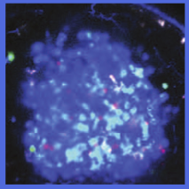
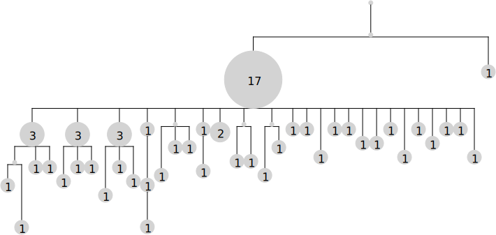
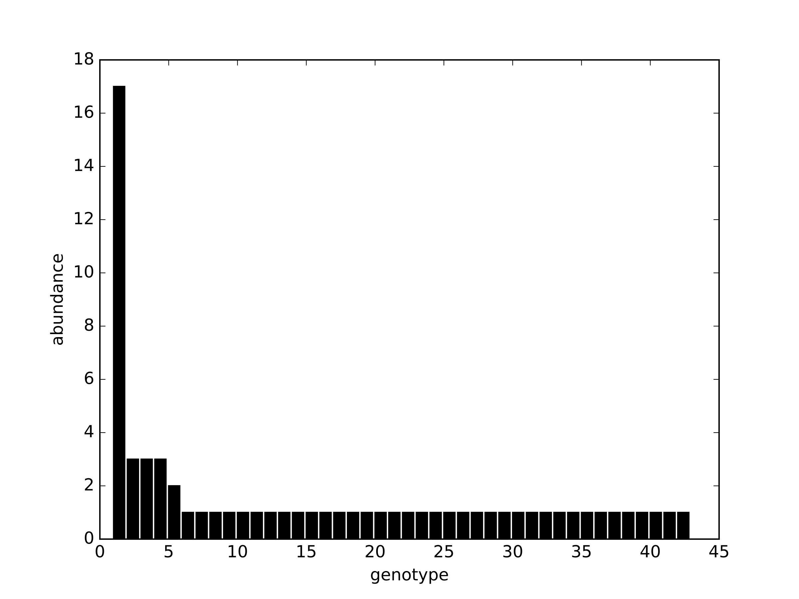

# GCtree

Implements phylogenetic inference for data with repeated sequences, as described in:

DeWitt, Mesin, Victora, Minin and Matsen, *Using genotype abundance to improve phylogenetic inference*, [arXiv:1708.08944](https://arxiv.org/abs/1708.08944).

Two programs are implemented:
- an inference program for experimental input data in `FASTA` or `PHYLIP` format (including an additional sequence for the ancestral state)
- a simulation/inference/validation program

All commands should be issued from within the gctree repo directory.

## DEPENDENCIES
* scons
* Python 2.7, with modules:
  * scipy
  * matplotlib
  * seaborn
  * pandas
  * biopython
  * [ete3](http://etetoolkit.org)
  * [nestly](https://pypi.python.org/pypi/nestly)
* [PHYLIP](http://evolution.genetics.washington.edu/phylip)
* X11 or xvfb-run (for rendering phylogenetic trees using ete3)
* [seqmagick](https://github.com/fhcrc/seqmagick)

## INSTALLATION STEPS

### Linux/MacOS

0. For installing dependencies, [conda](https://conda.io/docs/) environment management is recommended. First install conda or miniconda.
1. Create a python2.7 conda environment (named gctree in this example):
    ```bash
    conda create --name gctree python=2.7
    ```
2. Activate the environment:
    ```bash
    source activate gctree
    ```
3. Install ete3:
    ```bash
    conda install -c etetoolkit ete3 ete3_external_apps
    ```
4. Install python packages:
    ```bash
    conda install biopython matplotlib pandas scipy scons seaborn
    ```
5. Install nestly
    ```bash
    conda install -c conda-forge nestly
    ```
6. Install PHYLIP:
    ```bash
    conda install -c bioconda phylip
    ```
7. Install seqmagick:
    ```bash
    conda install -c cswarth seqmagick
    ```
8. Install jellyfish for faster string comparison (optional)
    ```bash
    conda install -c conda-forge jellyfish
    ```

## QUICK START

### inference
- *input file*: `FASTA` or `PHYLIP` file containing a sequence for each observed individual/cell, and an additional sequence containing the ancestral genotype of all observed sequences (used for outgroup rooting).
- *run inference*:
    ```
    scons --inference --outdir=<output directory path> --input=<input FASTA or PHYLIP file> --naiveID=<id of ancestral sequence in input file>
    ```
- *description of inference output files*: After the inference pipeline has completed, the output directory will contain the following output files:
    - `<input file>.idmap`: text file mapping collapsed sequenced ids to cell ids from the original input file
    - `<input file>.counts`: text file mapping collapsed sequenced ids to their abundances
    - `<input file>.phylip`: phylip alignment file of collapsed sequences for computing parsimony trees
    - `dnapars/`: directory of parsimony tree output from PHYLIP's dnapars
    - `gctree.inference.*.svg`: rendered tree images for each of the parsimony trees
    - `gctree.inference.abundance_rank.pdf`: histogram of genotype abundances
    - `gctree.inference.likelihood_rank.pdf`: rank plot of GCtree likelihoods for the parsimony trees
    - `gctree.inference.log`: log file containing parameter fits, numerical likelihood results, and any other program messages
    - `gctree.inference.parsimony_forest.p`: a python pickle file containing the parsimony trees as `CollapsedTree` objects


### simulation
```
scons --simulate  --outdir=<output directory path> --N=<integer population size to simulate>
```

## EXAMPLE

### run GCtree inference on the included `FASTA` file

* **Example input data set**
    `example/150228_Clone_3-8.fasta` contains heavy chain V gene sequences from 65 germinal B cells sorted from a brainbow mouse using multicolor fate mapping.
    ```
  $ head example/150228_Clone_3-8.fasta
  >VIBM1S4A05IgG
  ggacctagcctcgtgaaaccttctcagactctgtccctcacctgttctgtcactggcgac
  tccatcaccagtggttactggaactggatccggaagttcccagggaatagacttgagtac
  atggggtacataagcttcagtggtggtacttactacaatccatctctcaaaagtcgaatc
  tccatcactcgagacacatccaagaaccagtaccacctgcagttgaattctgtgactact
  gaggacacagccacatattactgt
  >VIBM1S4A06IgG
  ggacctagcctcgtgaaaccttctcagactctgtccctcacctgttctgtcactggcgac
  tccatcaccagtggttactggaactggatccggaagttcccagggaatagacttgagtac
  atggggtacataagcttcagtggtagcacttactacaatccatctctcaaaagtcgaatc
    ```
    These data were published in [Tas et al. 2016. *Visualizing Antibody Affinity Maturation in Germinal Centers.* Science 351 (6277)](http://science.sciencemag.org/content/351/6277/1048)) and shown in Fig. 4 (lymph node 2, germinal center 1).

    

* **Run inference**  

    From within the `gctree` repository directory:
    ```
  scons --inference --input=example/150228_Clone_3-8.fasta --outdir=test --converter=tas --naiveID=GL --jobs=2
    ```
    This command will produce output in subdirectory `test/`.
    This includes a log file with some messages about results (including the number of trees and the fitted branching process parameters), and then lists each parsimony tree by decreasing likelihood (with tree 1 corresponding to the GCtree MLE).
    ```bash
  $ head test/gctree.inference.log
  number of trees with integer branch lengths: 58
  58 trees exhibit unobserved unifurcation from root. Adding psuedocounts to these roots
  params = [0.4961832081885355, 0.36484189590092164]
  tree	alleles	logLikelihood
  1	48	-79.016217483
  2	48	-79.016217483
  3	48	-80.0883965146
  4	48	-80.1148297716
  5	49	-80.3507858934
  6	49	-80.3507858934
    ```
    For each tree, the directory will include an SVG file rendering of the tree. E.g. the MLE `test/gctree.inference.1.svg`:
    
    There is also a rank plot of genotype abundance `test/gctree.inference.abundance_rank.png`:
    
    and of GCtree likelihood over the trees `test/gctree.inference.likelihood_rank.png`:
    

    Finally, there are text files indicating abundance of each unique sequence,
    ```
  $ head test/150228_Clone_3-8.counts
  seq22,3
  seq23,1
  seq20,1
  seq21,1
  seq26,1
  seq27,1
  seq24,1
  seq25,1
  seq28,1
  seq29,1    
    ```
    the mapping of unique sequence ids to the sequence ids in the input `FASTA`,
    ```
  $ head test/150228_Clone_3-8.idmap
  seq22,VIBM1S4B10IgG:VIBM1S4C09IgG:VIBM1S4H12IgG
  seq23,VIBM1S4E03IgG
  seq20,VIBM1S4D02IgG
  seq21,VIBM1S4A05IgG
  seq26,VIBM1S4F11IgG
  seq27,VIBM1S4E12IgG
  seq24,VIBM1S4B03IgG
  seq25,VIBM1S4D05IgG
  seq28,VIBM1S4G04IgG
  seq29,VIBM1S4E09IgG
    ```
    and the `PHYLIP` alignment of the unique sequences,
    ```
  $ head test/150228_Clone_3-8.phylip
   43 264
  gl         ggacctagcc tcgtgaaacc ttctcagact ctgtccctca cctgttctgt
  seq1       ggacctagcc tcgtgaaacc ttctcagact ctgtccctca cctgttctgt
  seq2       ggacctagcc tcgtgaaacc ttctcagact ctgtccctca cctgttctgt
  seq3       ggacctagcc tcgtgaaacc ttctcagact ctgtccctca cctgttctgt
  seq4       ggacctagcc tcgtgaaacc ttctcagact ctgtccctca cctgttctgt
  seq5       ggacctagcc tcgtgaaacc ttctcagact ctgtccctca cctgttctgt
  seq6       ggacctagcc tcgtgaaacc ttctcagact ctgtccctca cctgttctgt
  seq7       ggacctagcc tcgtgaaacc ttctcagact ctgtccctca cctgttctgt
  seq8       ggacctagcc tcgtgaaacc ttctcagact ctgtccctca cctgttctgt
    ```
    When using the optional `--idlabel` flag, which shows labels `seq1, seq2, ...` in the tree rendering (see documentation below), these id/sequence files can be used to associate DNA sequences or cell labels with specific tree nodes.

* **Explanation of arguments**    

    `--outdir=test` specifies that results are to be saved in directory `test/` (which will be created if it does not exist)

    `--converter=tas` argument means that integer sequence IDs in the input file are interpreted as abundances. The example input `FASTA` includes a sequence with id "17".

    `--naiveID=GL` indicates that the root naive sequence has id "GL" in the input `FASTA`. This sequence is the germline sequence of the V gene used in the V(D)J rearrangement that defines this clonal family.

    `--jobs=2` indicates that 2 parallel processes should be used

    If running on a remote machine via ssh, it may be necessary to provide the flag `--xvfb` which will allow X rendering of ETE trees without X forwarding.

## INFERENCE

`scons --inference ...`

### required arguments

`--input=[path]` path to `FASTA` or `PHYLIP` input alignment

`--outdir=[path]` directory for output (created if does not exist)

`--naiveID=[string]` ID of naive sequence in input file used for outgroup rooting, default 'naive'. For BCRs, we assume a known naive V(D)J rearrangemnt is an additional sequence in our alignment, regardless of whether it was observed or not. This ancestral sequence must appear as an additional sequence. For applications without a definite root state, an observed sequence can be used to root the tree by duplicating it in the alignment and giving it a new id, which can be passed as this argument.

### optional arguments

`--colorfile=[path]  ` path to a file of plotting colors for cells in the input file. Example, if the input file contains a sequence with ID `cell_1`, this cell could be colored red in the tree image by including the line `cell_1 red` (where the whitespace is a tab) in the color file.

`--bootstrap=[int] ` boostrap resampling, and inference on each, default no bootstrap

`--converter=[string]` if set to "tas", parse input IDs that are integers as indicating sequence abundance. Otherwise each line in the input is assumed to indicate an individual (non-deduplicated) sequence. **NOTE:** the example input `FASTA` file `example/150228_Clone_3-8.fasta` requires this option.

## **SIMULATION**

`scons --simulation ...`

### required arguments

`--N=[int]` populaton size to simulate. Note that `N=1` is satisfied before the first time step, so this choice will return the root with no mutation.  

`--outdir=[path]` directory for output (created if does not exist)

### optional arguments

`--naive=[string]             ` DNA sequence of naive sequence from which to begin simulating, a default is used if omitted

`--mutability=[path]          ` path to S5F mutability file, default 'S5F/mutability'

`--substitution=[path]        ` path to S5F substitution file, default 'S5F/substitution'

`--lambda=[float, float, ...] ` values for Poisson branching parameter for simulation, default 2.0

`--lambda0=[float, float, ...]` values for baseline mutation rate, default 0.25

`--T=[int]                    ` time steps to simulate (alternative to `--N`)

`--nsim=[int]                 ` number of simulation of each set of parameter combination, default 10

`--n=[int]                    ` number of cells to sample from final population, default all

## OPTIONAL ARGUMENTS FOR BOTH INFERENCE AND SIMULATION PROGRAMS

`--jobs=[int]  ` number of parallel processes to use

`--srun        ` should cluster jobs be submitted with Slurm's srun?

`--frame=[int] ` codon reading frame, default `None`

`--quick       ` less thorough parsimony tree search (faster, but smaller parsimony forest)

`--idlabel     ` label sequence IDs on tree, and write `FASTA` alignment of distinct sequences. The mapping of the unique names in this `FASTA` file to the cell names in the original input file can be found in the output file with suffix `.idmap`

`--xvfb        ` needed for X rendering in on remote machines

   * Try setting the above option if you get the error:`ETE: cannot connect to X server`

## `gctree.py`
Underlying both pipelines is the `gctree.py` Python library (located in the `bin/` subdirectory) for simulating and compute likelihoods for collapsed trees generated from a binary branching process with mutation and infinite types, as well as forests of such trees. General usage info `gctree.py --help`. There are three subprograms, each of which has usage info:
* `gctree.py infer --help`: takes an `outfile` file made by phylip's `dnapars` as a command line argument, converts each tree therein to a collapsed tree, and ranks by GCtree likelihood.
* `gctree.py simulate --help`: simulate data
* `gctree.py test --help`: performs tests of the likelihood and outputs validation plots.

The under-the-hood functionality of the `gctree.py` library might be useful for some users trying to go beyond the scons pipelines. For example mapping colors to tree image nodes can be achieved with the `--colormap` argument. Colors can be useful for visualizing other cell/genotype properties on the tree.

## FUNCTIONALITY UNDER DEVELOPMENT

### arguments for both inference and simulation programs

`--igphyml`  include results for tree inference with the IgPhyML package

`--dnaml`    include results for maximum likelihood tree inference using `dnaml` from the PHYLIP package

`--nogctree` do not perform gctree inference

### arguments for non-neutral simulation

`--selection`    simulation with affinity selection

`--target_dist`  distance to selection target

`--target_count` number of targets

`--verbose`      verbose printing

`--carry_cap`    carrying capacity of germinal center

`--skip_update`  skip update step

### additional dependencies for development functionality
* IgPhyML (https://github.com/kbhoehn/IgPhyML)
  * Needs to be in $PATH
* perl5, with modules:
  * PDL
  * PDL::LinearAlgebra::Trans

* installing python and perl dependencies *
```
sudo apt-get install python-pip scons
pip install --user ete3 seaborn numpy scipy matplotlib pandas biopython nestly
cpan
> install PDL
> install PDL::LinearAlgebra::Trans
```
